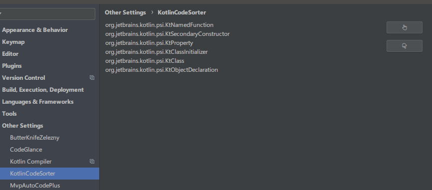

# Kotlin Code Sorter

A simple plugin for sorting kotlin code. [Machine Translate English ReadMe](./README_en.md)

  一个可以对kotlin代码排序的小插件.最近在日常的开发中,发现kotlin的代码排列不如Java的好,在IDEA或者AndroidStudio里面Java的字段一般在前,方法在后,看起来比较感觉比较好.但是在kotlin中覆写的变量和函数是根据覆写的先后顺序来排列的,后写的在前面,先写的在后面.而且字段和函数是穿插排列的,真是逼死强迫症,
  有了这个小插件,轻轻一按瞬间排好,美滋滋.

## 特征

-   支持按照字段->初始化块->构造方法->方法->内部类的默认顺序对代码进行排序.
-   从1.2开始可以在设置界面自定义排序顺序.

## 安装

- **使用 IDE 内置插件系统安装:**
  - <kbd>File</kbd> > <kbd>Preferences(Settings)</kbd> > <kbd>Plugins</kbd> > <kbd>Browse repositories...</kbd> > <kbd>搜索并找到"Kotlin code sotrer"</kbd> > <kbd>Install Plugin</kbd>

- **手动安装:**
  - 下载[`最新发布的插件包`][latest-release] > <kbd>File</kbd> ><kbd>Preferences(Settings)</kbd> > <kbd>Plugins</kbd> > <kbd>Install plugin from disk...</kbd>

重启**IDE**.

## 使用

1. 默认快捷键 Ctrl + Alt + K.可自行修改:
   
   
2. 当然也可以点击<kbd>Code</kbd> > <kbd>Sort kotlin code</kbd> > <kbd>fields->initializer->constructors->functions</kbd> 

3. 点击<kbd>File</kbd> ><kbd>Settings</kbd> ><kbd>Other Settings</kbd> ><kbd>Kotlin Code Sorter</kbd> 可以调整自己喜欢的排列顺序:

   

   

灵感来自[Lifecycle Sorter](https://plugins.jetbrains.com/plugin/7742-lifecycle-sorter)

[latest-release]: https://plugins.jetbrains.com/plugin/11163-kotlin-code-sorter

