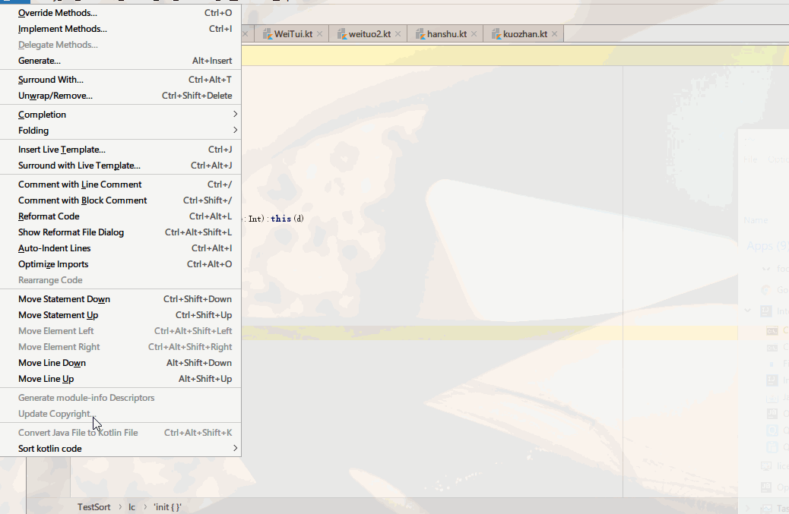
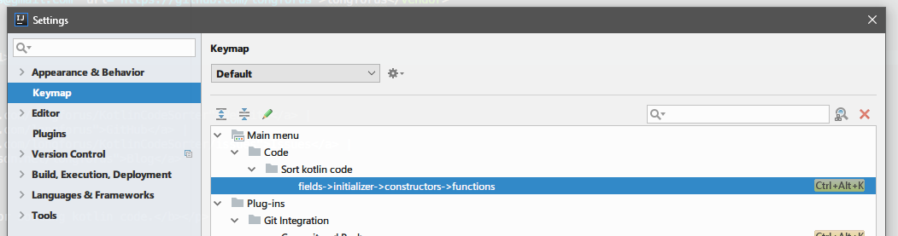

# Kotlin Code Sorter

A simple plugin for sorting kotlin code.

一个可以对kotlin代码排序的小工具.

## 特征

-   支持按照字段->初始化块->构造方法->方法->内部类的顺序对代码进行排序.

## 安装

- **使用 IDE 内置插件系统安装:**
  - <kbd>File</kbd> > <kbd>Preferences(Settings)</kbd> > <kbd>Plugins</kbd> > <kbd>Browse repositories...</kbd> > <kbd>搜索并找到"Kotlin code sotrer"</kbd> > <kbd>Install Plugin</kbd>

- **手动安装:**
  - 下载[`最新发布的插件包`][latest-release] > <kbd>File</kbd> ><kbd>Preferences(Settings)</kbd> > <kbd>Plugins</kbd> > <kbd>Install plugin from disk...</kbd>

重启**IDE**.

## 使用

  默认快捷键 Ctrl + Alt + K.可自行修改:

[latest-release]: https://plugins.jetbrains.com/plugin/11163-kotlin-code-sorter